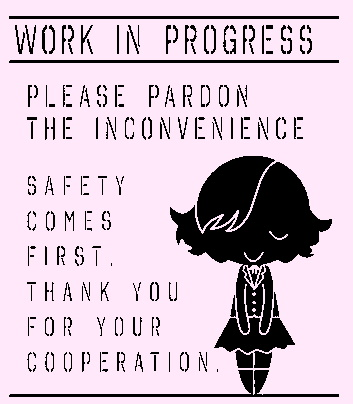
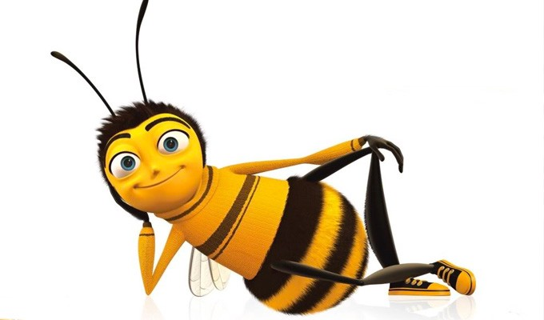

# My first landing page !

*Hi, I'm Olivia Fantinel, and I'm learning how to code !*

>Let's fill the world with love through code !

*note : this is a temporary catchphrase, I'll find a better one

I'm doing this landing page to learn Markdown, HTML and CSS. I'm using a template right now, but I would like to personnalize it later. 

I would like to use Markdown efficiently, so I'm using this README as a sandbox.

## Let's use some markdown !

I'll describe what my landing page will look like and my different ideas.

* **Links to social medias**
* **Stylizing**
    * I would like to make a *cute* vibe, but still professionnal
    * white, light pink and light blue
    * Tahoma or helvetica are both good fonts
* **Little animations**
* **Who am I, what am I coding, etc**

## Thanks for reading !

I'm trying to figure things by myself, but many people are helping me, and if you are reading this right now, you are probably one of those !

**Thank you !**

I wouldn't be able to do all those things without your help, I'm really grateful to you.

>Howdy, I'm a bug. I shouldn't bee in your code, try to rollback to a previous commit.